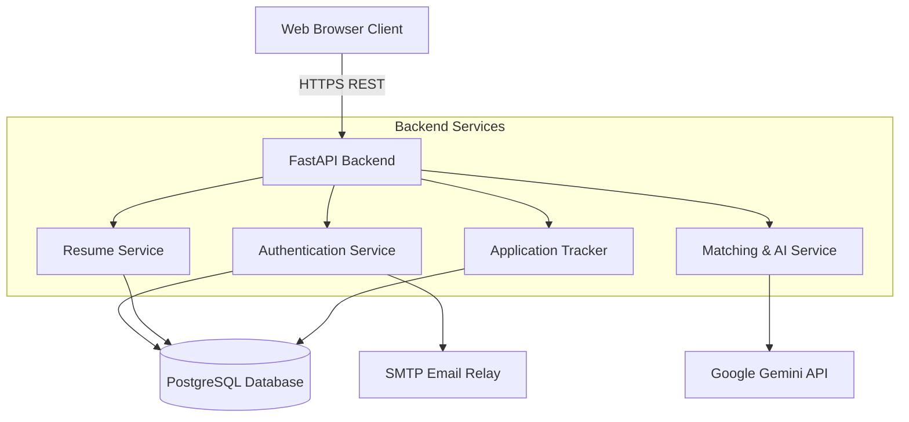
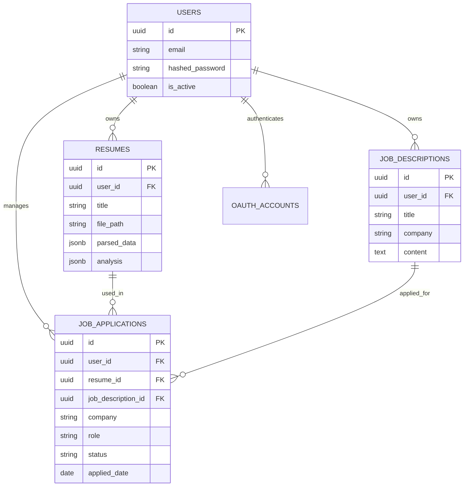

# CareerPilot AI 🚀

CareerPilot AI is an advanced, AI-powered career assistant built to streamline the job application process. It offers intelligent resume parsing, matching against job descriptions, ATS optimization insights, and job application tracking.

Whether you're a job seeker looking to optimize your resume for applicant tracking systems, or a professional managing dozens of applications, CareerPilot AI helps you apply smarter.

---

## 🌟 Key Features

*   **Resume Analyzer:** Upload your PDF resumes, automatically extract key skills, and receive an AI-generated analysis.
*   **Job Description (JD) Matcher:** Compare your resume directly against specific job descriptions to instantly see match percentages, missing keywords, and profile gaps.
*   **ATS Optimization:** Receive actionable suggestions on how to reword your resume to pass automated screening filters.
*   **Application Tracker:** Keep a centralized log of all your job applications, their current status (Applied, Interviewing, Offered, Rejected), and associated notes.
*   **Secure Authentication:** End-to-end secure user authentication with Google OAuth integration and standardized SMTP transactional emails for password resets.

---

## 📸 Screenshots

*(Replace these placeholders with actual screenshots of your deployed app)*

| Dashboard | Resume Analysis |
| :---: | :---: |
|  |  |

| JD Matcher | Application Tracker |
| :---: | :---: |
|  |  |

---

## 🛠 Tech Stack

**Frontend:**
*   React 18 (Vite)
*   TypeScript
*   Tailwind CSS + Radix UI (shadcn/ui inspired)
*   React Router DOM

**Backend:**
*   FastAPI (Python 3.11)
*   SQLAlchemy + AsyncPG
*   Alembic (Migrations)
*   Pydantic V2

**Infrastructure & Database:**
*   PostgreSQL 16
*   Docker & Docker Compose
*   Gemini Pro API (AI Integrations)

---

## 🏗 Architecture Diagram



---

## 🗄️ Database Entity-Relationship (ER) Diagram



---

## 🚀 Local Setup Guide

Follow these steps to run CareerPilot AI on your local machine using Docker.

### Prerequisites
*   [Docker](https://docs.docker.com/get-docker/) and Docker Compose installed.
*   [Git](https://git-scm.com/) installed.
*   A Google Gemini API key.

### Installation

1.  **Clone the repository**
    ```bash
    git clone https://github.com/jeffy-sajan/careerpilot-ai.git
    cd careerpilot-ai
    ```

2.  **Configure Environment Variables**
    Duplicate the example `.env` file and fill in your secrets.
    ```bash
    cp backend/.env.example backend/.env
    ```
    *Ensure you populate `GEMINI_API_KEY`, `SECRET_KEY`, and `SESSION_SECRET_KEY` in `backend/.env`.*

3.  **Start the Application**
    Run the multi-container Docker app.
    ```bash
    docker compose up --build
    ```

4.  **Access the App**
    *   **Frontend:** `http://localhost:5173`
    *   **Backend API & Docs (Swagger):** `http://localhost:8000/docs`

---

## 📦 Deployment & Database Backup

### Deployment Link
*(Add your live URL here once deployed)*
*   **Live App:** [https://careerpilot.ai](#)

### Database Backup Strategy
To ensure no data is lost in production, it is critical to run daily backups of your PostgreSQL database. 

If you deploy to a VPS (like DigitalOcean or AWS EC2), set up a simple `cronjob` to run a `pg_dump` daily. 

**Example Backup Command (run via cron):**
```bash
# Dump the careerpilot database inside the docker container to a daily backup file
docker exec -t careerpilot_postgres pg_dump -U postgres -d careerpilot -F c -f /tmp/db_backup_$(date +%Y%m%d).dump

# Copy the dump from the container to your host machine's backup directory
docker cp careerpilot_postgres:/tmp/db_backup_$(date +%Y%m%d).dump /path/to/host/backups/
```
*Note: If you use a managed database (e.g., AWS RDS, Supabase, Render PostgreSQL), backups are typically handled automatically by the provider.*

---

## 📜 License

[MIT License](LICENSE)
